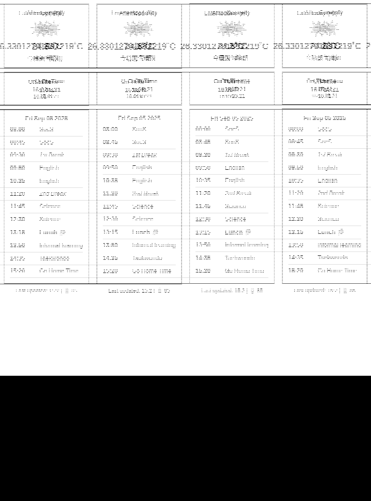
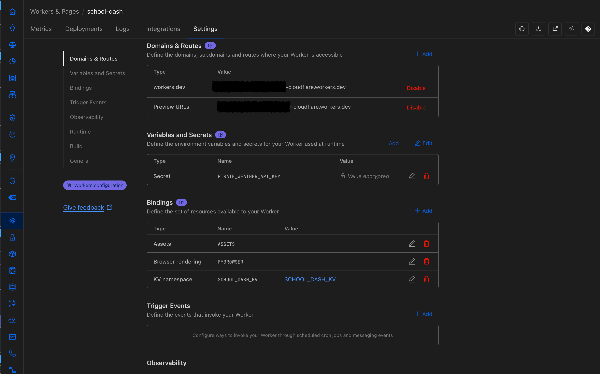

# Kindle Dashboard

The server component of the project to transforms your jailbroken Kindle into a customizable dashboard display. It works by periodically fetching images from a server at regular intervals.



## Overview

Turn your jailbroken Kindle into a low powered dashboard. The system works by executing a script (`dash.sh`) that periodically fetches PNG images from a Cloudflare worker and displays it on the Kindle's e-ink screen. I use this to show today's weather, arrival data for the bus stop next door and the day's timetable for my daughter's school. You can use it to display any other information you want to display in a low-power, always-on format.

## Prerequisites

- A jailbroken Kindle device (tested on my old Kindle 10th Gen model)
- Basic knowledge of Linux commands and shell scripting
- Cloudflare worker to host the 
- SSH access to your Kindle
- Image must be 8 bit grayscale in the correct resolution. 
  Find the correct resolution using `eips -i` command on the kindle.


## Installation

### 1. Free Cloudflare account

This project uses Cloudflare developer platform which has a very generous free tier perfectly suited for this use case.
Get started with a free account at [Cloudflare Dash](https://dash.cloudflare.com/sign-up?pt=f).

### 2. Bun 
I used [Bun](https://bun.sh/) as the main development framework, but you can also choose use Node or Deno if that's your preference.

### 3. Wrangler 
Wrangler is the workhorse of Cloudflare developer platform. It's open source and can be installed from [Wrangler docs](https://developers.cloudflare.com/workers/wrangler/).


Cloudflare devs is a very active community and is very helpful. For advanced topics, refer to [Cloudflare developers]https://developers.cloudflare.com/) or the [Cloudflare Discord Server](https://discord.com/invite/cloudflaredev).

### 2. Set Up

   1. Clone this git repo and cd into it.

   2. Install [Bun](https://bun.sh/) and [npm](https://docs.npmjs.com/getting-started), preferably using a Node version manager like [Volta](https://volta.sh/) or [nvm](https://github.com/nvm-sh/nvm).

   3. Install the dependencies:
      ```bash
      bun install
      ```

   3. Install Wrangler
      ```bash
      npm install wrangler@latest
      ```

   4. Create the KV Namespaces for live and preview. Replace these values with the values in the `wrangler.jsonc` file.
      ```bash
      npx wrangler kv namespace create SCHOOL_DASH_KV
      npx wrangler kv namespace create SCHOOL_DASH_KV --preview
      ```   

   5. Create a secret in the Cloudflare dashboard for the API key.

      

   6. Start the local development:
      ```bash
      npx wrangler dev --remote
      ```
   7. The changes will be live on `localhost:8787`

   8.  Deploy the changes to your Cloudflare dash:
      ```bash      
      npx wrangler login
      bun run deploy
      ```
   


## License

This project is licensed under the MIT License - see the LICENSE file for details.

## Acknowledgments

- The Kindle jailbreak community for making projects like this possible
- [Hemant @ Terminal bytes](https://github.com/terminalbytes/kindle-dashboard)
- [Pascalw](https://github.com/pascalw/kindle-dash) and his Kindle Dash project

